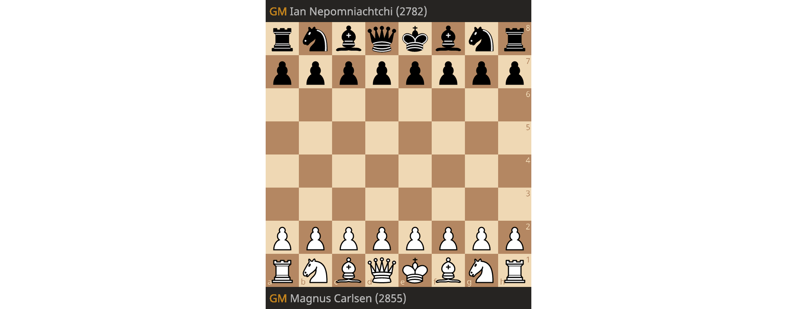

# Dr Marno van der Maas

This is my favorite chess game that was pivotal for Magnus Carlsen to beat Ian Nepomniachtchi in the 2021 World Chess Championship.

## About me

If you're passionate about hardware security and verification, please reach out! You can find out more about me on my [personal website](https://techroose.com/about.html).

Here's a few projects I would like to shout out:
- [Codeberg](https://codeberg.org/): free and open source development platform.
- [Lichess](https://lichess.org/): free and open source chess platform.
- [Mastodon](https://github.com/mastodon/mastodon): free and open source social media platform.
- [CHERI](https://www.cl.cam.ac.uk/research/security/ctsrd/cheri/): processor instruction set for solving memory vulnerabilities.
